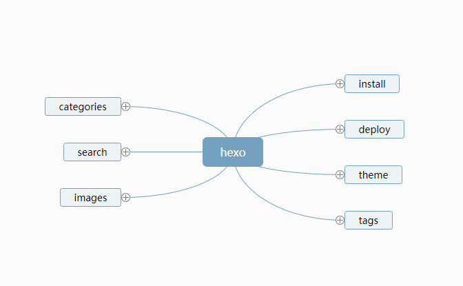

一，hexo install 安装
    安装好Git Nodejs
    通过git 安装hexo及常用命令


```
npm install hexo -g  //安装Hexo
hexo -v  //检查hexo是否安装成功
hexo init 'blog'//初始化该文件夹 cd blog
npm install //安装所需要的组件
hexo server //开启服务器 简写hexo s
hexo generate  //生成静态网页 简写hexo g
hexo deploy //开始部署coding、github  简写hexo d
hexo s --debug //调试模式
hexo new title //创建一篇新文章
hexo clean && hexo generate && hexo deploy //一键清除，生成，部署
```

    


----------

二，部署配置


```
deploy: //键值 : 后面带空格
  type: git
  repo: 
    github: git@github.com:xxx/Blog.git,master
    coding: git@git.coding.net:xxx/Blog.git,master 
```

        


----------


三，线上加载错乱的路径设置
github路径是git@github.com:xxx/Blog.git
在根目录设置root: /Blog/
一级域名，则不用


<a href="http://naotu.baidu.com/file/ebb77d3d6b03273046a19c36e69a4b83">个人在线的思维导图</a>

至于主题，喜欢折腾个自己喜欢的，next也不错，功能丰富，就是UI不够细致

